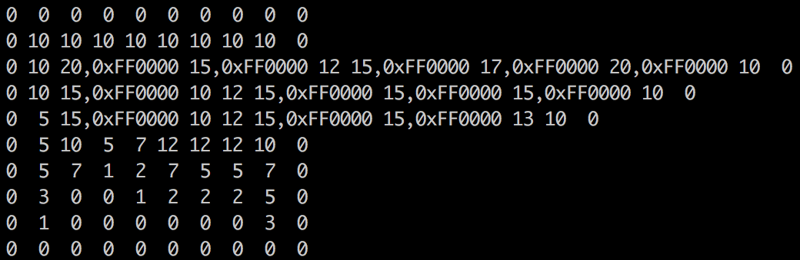
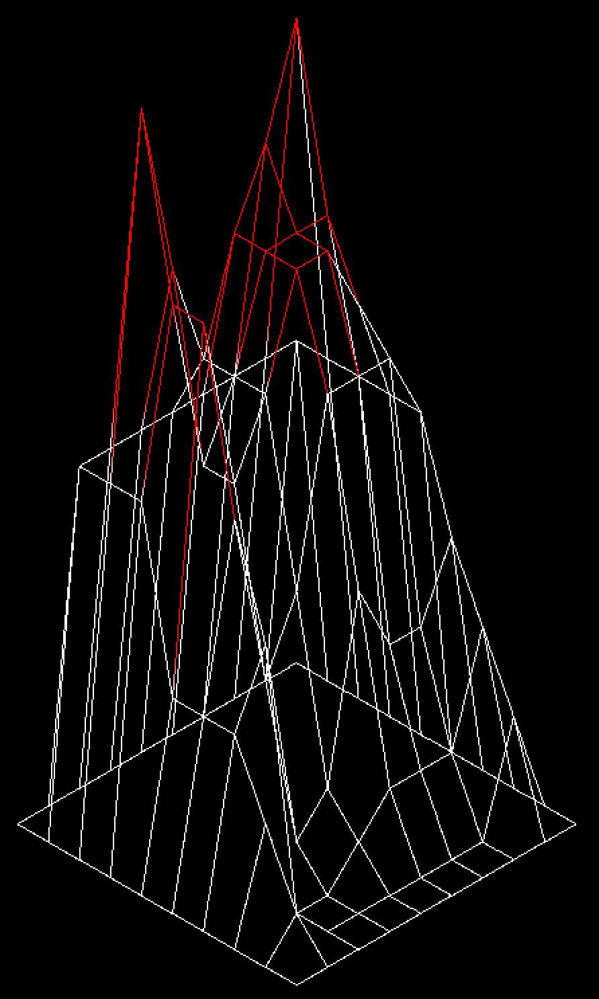

# <a name="top">fdf</a>

Fdf is a program that takes a file with coordinates and altitude information of a landscape and returns an isometric graphic wireframe representation drawn on a new window.

This program uses a graphics library (miniLibX) deveoped internally by 42 Silicon Valley. 

## Contents

[Language & Functions Used](#language_functions) | [Installation](#install) | [Usage & Example](#usage_example)

## <a name="language_functions">Language & Functions Used</a>

The fdf program is written in C, using only the following functions from the standard C libraries:

* open
* close
* read
* write
* malloc
* free
* exit
* functions defined in the math.h library
* functions defined in the miniLibX library

<a href="#top">↥ back to top</a>

## <a name="install">Installation</a>

#### `System Requirements`

The miniLibX library is only supported by 
* macOS Sierra
* macOS Elcapitan [files are included in the minilibx folder but you will need to change the source in the Makefile]

```
MLX = minilibx/minilibx_macos_elcapitan
```

#### `Step 1` - clone the repo

```bash
$ git clone https://github.com/serena-zhu/fdf.git
```

#### `Step 2` - compile program

```bash
$ make
```

The Makefile will compile a program named fdf.

<a href="#top">↥ back to top</a>

## <a name="usage_example">Usage & Example</a>

#### `General Usage`
```bash
$ ./ft_ssl
usage: ./fdf source_file
```
Running the program without any parameters will prompt the usage message.

#### `Invalid Files`
```bash
$ ./fdf invalid_file.fdf
error
```
Passing an invalid (or empty) file will prompt the error message. 

#### `Example of a Valid Map File`

Test maps are included in the [test_maps](/test_maps) folder. Below is the [elem-col.fdf](/test_maps/elem-col.fdf) file, for example:



Each number above corresponds to a point in space, where
* The horizontal position corresponds to its axis. 
* The vertical position corresponds to its ordinate.
* The value corresponds to its altitude with an optional color value in hexadecimal separated by a comma.

The colors along each line segment are interpolated by the default (white) or specified colors of the points at each end.

The number of values in the first line sets the range for horizontal position, therefore any extras will be ignored. The program will display an error message if subsequent lines contain fewer number of values.

#### `Example Program Output`

Here is the output of the [elem-col.fdf](/test_maps/elem-col.fdf) file shown in the example above:



<a href="#top">↥ back to top</a>